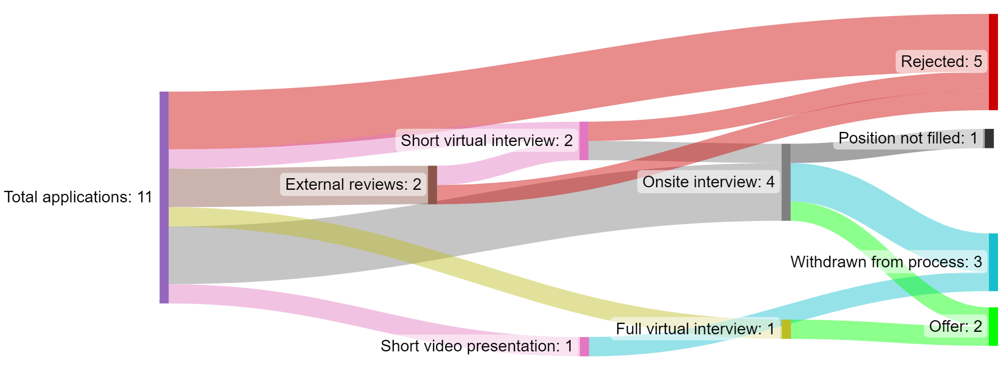

In August 2023, I start as an Assistant Professor in Software Engineering at the Free University of Amsterdam (the [VU](https://vu.nl/en)).
With this post, I want to reflect on my time on the academic job market, especially regarding typical application processes and participating in interviews.
The primary target audience are early-career researchers, especially advanced PhD students and fresh postdocs.
My goal is to share my concrete personal experience because I found very few reports online when I started applying.
I hope that this will give future applicants at least some insights into this shrouded process, even though your actual mileage may vary considerably in the end.

TL;DR:
- The first time you prepare your application package requires considerable effort
- At least some flexibility regarding the country is required for realistic chances
- Application processes differ vastly between institutions
- Many application processes are very intransparent
- Trying to pursue an academic career in Germany is incredibly frustrating

## Pursuing an Academic Career

Around January 2022, roughly 1.5 years after my PhD defense and into my Postdoc, I finally came to the conclusion that I wanted to at least try to pursue an academic career.
I had realized that I really love research, was decent at writing scientific papers, and also loved the prospect of work-related freedom that a professorship promised.
I had worked for more than 9 years in industry before and during my PhD, so I knew from personal experience that having the freedom to (more or less) pursue whatever topic you like is extremely hard to come by there, if not impossible.

Even though academia obviously has downsides as well, it appeared as the preferable choice of career to me and still does.
I was aware that my chances were far from great, but I thought that I at least owed it to myself to try.
Shortly afterwards, I subscribed to newsletters with academic job offers.[^1]
I didn't want to send out applications right away, but wanted to get a feeling for the market.

## Creating Your Application Package

Scanning the job offers in my field for a while gave me a decent understanding of how many suitable positions I could expect.
It also ensured that I knew which typical documents were expected.
Most of these I already had in some form or shape, but I definitely underestimated how much time it would take me to prepare the first final version.
Updating my general CV was fairly straightforward, but creating decent teaching and research statements from scratch was quite the effort.
It also took quite some time to compile the lists with the various things that are evaluated, e.g., publications, student supervisions, program committee activities, other academic services, etc.

I also needed to ask people to act as references for me during this process, and I quickly realized that 2 people, e.g., my 2 PhD advisors would not be enough.
Lastly, I also wanted to compare my documents with several others, so I searched a bit online.
I also had several friendly colleagues who shared their own applications with me and also reviewed my drafts, which was very helpful.

In the end, the first final version took me nearly two full weekends plus several evenings, so start preparing this way in advance!
Also try to continuously update and improve it whenever you receive feedback.
My documents were decently different at the end compared to the first version, and this was for the better.

## Location Flexibility

By reading academic job newsletters for a while, I quickly realized that it would not be feasible to only focus on the German state I was currently living in (Baden-Württemberg), let alone on Germany.
Chances that I would have won a professorship in commuting distance to our current apartment in Stuttgart in the next 3 years were, IMHO, near zero.

I had talked to my wife about leaving Germany before, but we now discussed this in more details, and came to a first consensus about countries we could imagine living in.
I was lucky enough that she was open to the idea, but, it is unfortunately the bitter truth that furthering your academic career will require considerable compromise from your partner.
This dilemma has also been described as [the two-body problem](https://en.wikipedia.org/wiki/Two-body_problem_(career)).
I am fully aware that she sacrificed her current social life and took a (small) hit in her own career as an architect for me, and I owe her for that!
Could it have worked out some other way? Sure!

- I could have considered universities of applied sciences (["Fachhochschulen"](https://en.wikipedia.org/wiki/Fachhochschule)), which would have led to an immense teaching load.
- We could have waited much longer until I was called for a suitable location, without any certainty.
- We could have considered a long-distance relationship for several years.

All of these were no options for us.
So, we decided on the following process: whenever I saw a job posting that I would consider, I first sent her the details.
She then did some research and decided if she could imagine living and working in this city.
If this was the case, I sent the application, otherwise, she vetoed it (which did happen sometimes).

## Diversity of Application Processes

I started to send out applications in August 2022, a bit more than 2 years after my PhD defense.
I had no real idea how many I would need until I scored my first offer.
Reading the few reports available online had scared me a bit because most had mentioned dozens of applications, some over 100.
My guess is that this sample was skewed by the US job market, where people seem to send out many more applications, but I could be wrong.
In total, I sent out 11 applications over a period of ~5 months.
10 of them were for Europe, among them, e.g., 4 in the Nordics, 2 in Germany, and 2 in the Netherlands.

Even though most required similar documents (with some exceptions), there were often differences between the format and the number of pages.
I obviously adjusted the letter of motivation every time, but in a lot of cases, I also had to shorten or extend other documents, or convert them into a certain format, most often for the teaching statement.
The different places also requested between 0 and 4 letters of references as a minimum, most often 3.
Despite having my basic set of documents ready, some applications took me surprisingly much effort, especially if they required me to fill in parts of my CV into some web form again...
I also applied to 2 universities who share the same CS department.
To my great surprise (and frustration), the requested documents and process couldn't have been more different.
(Spoiler alert: one of the processes was considerably worse from my applicant perspective.)

My applications were also processed very differently depending on the university.
Between 1 and 3 stages needed to be passed until a potential final offer.
Some processes included external reviews, some didn't.
Some had quick initial virtual interviews before the onsite ones, some didn't.
One even required to submit a video presentation of myself.

The onsite interviews were very different, too.
All included some form of presentation and a typical interview part with questions from the hiring committee.
But the requested presentation content, the allocated presentation time, and which other activities took place could vary considerably.
For example, requested presentation durations were between 15 and 40 minutes, and, during one onsite interview, I even had to perform a short teaching activity for a given topic with real students.
So, be ready to adjust to the circumstances of a given application process!
I tried to visualize parts of this diversity in the Sankey diagram below.

For 3 of my 11 applications, I was rejected right away.
The universities that disclosed this number received over 100 applications for the position.
However, I also reached the final stage for 5 universities.
One position was scratched by the rector after the interviews.
I never received the ranking of candidates for that one.

But I also received 2 offers.
During the negotiations with them, 3 other interview invitations reached me.
But once it became clear that I would reach an agreement at the VU Amsterdam, I declined all of these and withdrew my applications.
I decided to be fairly transparent during this process and clearly communicated other applications and offers.
I was pleasantly surprised how well people took this, but maybe I got lucky and the committee heads I interacted with were unusually professional and rational people.
So, decide for yourself what you want to communicate when.

And whatever you do, don't try to play games, e.g., accepting one job to suddenly decline it to go for another offer that just dropped.
This is not only unethical but also irrational in the long run: academic fields are smaller than you think and people definitely talk.
Playing these games in academia could substantially harm your reputation and get you blacklisted at various levels.
Also think of the time and effort that goes into such application processes!
So, take your time with the decision, ask for more time if needed, but if you accept an offer, stick to your word!

Regarding the transparency of the 11 application processes, there were again huge differences.
In some cases, it was extremely opaque what was currently happening or what stage my own application was currently in.
Several times, the application deadline was extended (sometimes by several months) without clearly communicating this, let alone why they had done this.
Several places didn't announce a preliminary timeline.
In one case, I already thought I was out and then received the interview invitation close to reaching the end of my ongoing negotiations.
They had simply taken an unusually long time to process the applications.
Lastly, I still haven't received the official rejection from one place, unfortunately a German "tradition"...
I only know that I'm out because I know someone who attended the interview there.

However, there were also great examples of transparency, most of them from the Nordics:
clearly communicated timelines for the different stages, emails detailing what would happen next as soon as a stage was finalized, results of the external reviews, and great write-ups what to expect for the final interview.
It definitely is possible for universities to make the applicants' lives easier.
If you are unsure about your current status at a place you care about and need this info to make a decision, write to them!

## My Frustration With the German Academic System

Finally, I want to voice my disillusionment with the prospects of an academic career in Germany.
Don't get me wrong: I think I received an excellent education here, had very benevolent PhD advisors, and met a ton of great and friendly people at German universities.
But, over the years, I also realized that the German academic system (as a whole, not on an individual basis) doesn't care about early-career researchers.
[Junior Professorships](https://en.wikipedia.org/wiki/Junior_professorship), the German equivalent to Assistant Professorships, are still fairly rare and often blatantly offered without a tenure track.
Only 2 of my 11 applications were for German universities.
I did not select them because these were great places for my field, but simply because they were the only German ones that I could find for Software Engineering over a period of more than 6 months (excluding non-tenure-track ones).

However, it also would have been pointless for me to apply for Full Professorships: with my academic age, I would never have been invited for an interview, especially without having a habilitation.
There are also many offers for temporary "Junior Group Leader" positions, where you basically perform the same duties as an Assistant Professor, but without tenure track and with less salary, in short an exploitation of Postdocs without giving them any job safety or prospects.
Germany also doesn't have Associate Professorship positions, meaning that you either have to make the jump from postdoc to Full Professor, which is incredibly difficult, or from Junior Professor to Full Professor, wich is also difficult because there are so few Junior Professorships and several don't even have a tenure track.

This frustration of German early-career researchers has culminated on social media under the hashtag \#ichbinhanna ("I am Hanna").
You can read more about it in [this article](https://www.nature.com/articles/s41562-021-01178-6) in Nature Human Behaviour or on [this website](https://ichbinhanna.wordpress.com/english-version/) from the hashtag initiators.
I definitely will be a bit sad to leave Stuttgart and my great research group, but I won't shed a single tear for leaving the German academic system.
I very much look forward to performing excellent research and teaching for a country that really values early-career researchers, and can only suggest that other young highly-qualified researchers do the same, until the Federal Ministry of Education and Research (BMBF) finally realizes that they are driving our country's academic system into the ground.

\#ichwarhanna

Disclaimer:
All of this is written from my subjective and European perspective on the academic job market for an Assistant Professorship in Software Engineering at research universities (not universities of applied sciences).
Not all points will be directly transferrable to other subfields of Computer Science, even less to other scientific disciplines, and probably also not to the US.

Acknowledgements:
I am very grateful to [Daniel Graziotin](https://ineed.coffee/) and [Marvin Wyrich](https://marvin-wyrich.de/) for reviewing a first draft of this blog post.
Their feedback improved this post substantially.

[^1]: Some examples were [https://academicpositions.com](https://academicpositions.com), [https://www.academics.com](https://www.academics.com), [https://polytechnicpositions.com](https://polytechnicpositions.com), [https://computeroxy.com](https://computeroxy.com), or [https://facultyvacancies.com](https://facultyvacancies.com).